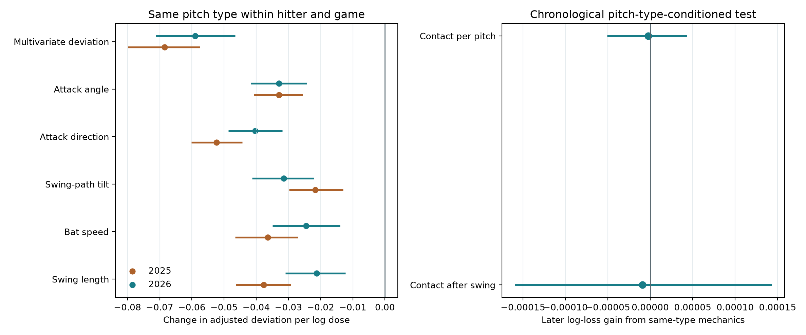

# Abstract claim audit: Same-Type Mechanical Adjustment Across Pitchers

## Data and design

The project uses frozen public MLB Statcast pitch-level and bat-tracking records. Bat tracking began in the second half of 2023, according to the [MLB Statcast glossary](https://www.mlb.com/glossary/statcast). The expected-swing reference was fitted before 2025 and produces a context-adjusted multivariate swing deviation for tracked swings. This audit uses the existing 2025 and 2026 analytic swings, all delivered 2026 pitches, and frozen pitch-context forecasts. No new data were necessary because another partial day would not provide an independent replication season.

The corrected exposure counts every earlier delivered pitch of the same Statcast type to the hitter in the game, regardless of pitcher. Takes and untracked swings contribute to the count, and the current pitch does not. The population test compares tracked swings within a hitter-game-pitch-type group. The frozen swing reference already adjusts for pitcher identity, pitch location, movement, velocity, handedness, count, and other observed context. The controlled model also includes exposure to other pitch types and progress within the plate appearance. Hitter resampling supplies intervals. A negative coefficient means that realized mechanics move closer to the context-specific expected swing as same-type exposure accumulates.

## Systematic change in swing geometry

| Season | Tracked swings in repeated type groups | Hitter-game-type groups | Controlled slope [95% hitter interval] |
|---|---:|---:|---:|
| 2025 | 249,774 | 85,210 | -0.068461 [-0.079814, -0.057487] |
| 2026 | 238,111 | 82,570 | -0.059036 [-0.071233, -0.046583] |

The [full table](../results/abstract_claim_audit/population_changes.csv) reports the multivariate outcome and all five component outcomes in both seasons. It also reports a stricter sensitivity that adds same-pitcher, same-type exposure as a separate control:

| Season | Same-type coefficient after same-pitcher exposure control [95% hitter interval] |
|---|---:|
| 2025 | -0.049323 [-0.064753, -0.035317] |
| 2026 | -0.035892 [-0.050018, -0.021558] |

The pooled same-type association replicates across seasons. The stricter coefficient isolates variation beyond repetition against the current pitcher and should be used to judge a strong cross-pitcher transfer claim. Because the two histories are highly related within games, that sensitivity is less precise and estimates a different contrast.

## Does earlier same-type geometry predict later contact?

For every 2026 outcome pitch, a chronological feature builder summarizes only earlier swings of the realized pitch type by that hitter in the game, pooling across pitchers. Penalized logistic models fit before July 1 and are evaluated on later pitches without refitting. Both models receive the frozen context probability, realized pitch type, current-pitcher history, and earlier same-type contact and swing rates. The candidate adds the mean earlier same-type mechanical deviation. Contact per delivered pitch is primary and contact after a swing is secondary. Positive log-loss gain favors the mechanics model. This test is prospectively ordered, but it is pitch-type-conditioned because the realized type selects the relevant history.

| Outcome | Later subset | Pitches | Added mechanics gain [95% hitter interval] | [95% game interval] |
|---|---|---:|---:|---:|
| Contact per pitch | All later pitches | 311,722 | -0.000000 [-0.000024, +0.000024] | -0.000000 [-0.000018, +0.000019] |
| Contact per pitch | Earlier same-type tracked swing | 139,919 | -0.000002 [-0.000051, +0.000043] | -0.000002 [-0.000042, +0.000040] |
| Contact per pitch | Two earlier same-type tracked swings | 64,143 | +0.000004 [-0.000052, +0.000069] | +0.000004 [-0.000049, +0.000054] |
| Contact after swing | All later pitches | 149,681 | -0.000003 [-0.000077, +0.000072] | -0.000003 [-0.000070, +0.000062] |
| Contact after swing | Earlier same-type tracked swing | 73,407 | -0.000009 [-0.000160, +0.000143] | -0.000009 [-0.000149, +0.000131] |
| Contact after swing | Two earlier same-type tracked swings | 34,539 | +0.000011 [-0.000148, +0.000199] | +0.000011 [-0.000155, +0.000175] |

The [complete forecast comparisons](../results/abstract_claim_audit/lagged_forecast_gains.csv) include the gain from adding prior outcomes and a last-observed-mechanics sensitivity. The [pitch-level predictions](../results/abstract_claim_audit/predictions_later.parquet) preserve matched rows.

A strict transfer diagnostic removes same-pitcher swings from the mechanical history. It evaluates later pitches only when the hitter has an earlier tracked swing of that type from another pitcher:

| Outcome | Later pitches | Added other-pitcher mechanics gain [95% hitter interval] |
|---|---:|---:|
| Contact per pitch | 56,274 | +0.000017 [-0.000013, +0.000048] |
| Contact after swing | 27,359 | +0.000024 [-0.000137, +0.000197] |

The [strict transfer table](../results/abstract_claim_audit/conditional_type_gains.csv) also reports the first pitch of that type from the current pitcher when another-pitcher tracked history exists.

## Is the response a persistent individual trait?

The hierarchical curves already use same-type exposure pooled across pitchers. Their raw 2025-to-2026 Spearman correlation is -0.028 across 465 hitters. The measurement-error model estimates latent correlation -0.134 with a 90% player-bootstrap range [-0.844, +0.385], and the model flags the correlation as weakly identified. The 2025 and 2026 split-half rank correlations are +0.027 and +0.008. Applying 2025 player curves to 2026 changes centered mechanical prediction error by -0.0050% relative to a population curve, with a 90% game-bootstrap interval [-0.0093%, -0.0005%]. These results do not support stable hitter rankings.

The [interactive player curves](../notebooks/player_curves.html) and [curve table](../results/cross_pitcher/player_curves.csv) use the corrected exposure definition for every eligible hitter. A hierarchy can estimate a curve and its uncertainty even when temporal validation does not support treating the ordering as established talent.

## Verdict for the supplied abstract

The corrected analysis supports a population statement: swing geometry moves systematically toward its context-specific expectation as hitters accumulate same-type looks within a game, pooling those looks across pitchers. It does not establish that the movement is a causal learning response, that the isolated other-pitcher component replicates, that hitter rankings persist, or that earlier mechanics improve later contact prediction. The [frozen protocol](../config/abstract_claim_audit.json), [source hashes and counts](../results/abstract_claim_audit/summary.json), and [lagged-history unit test](../tests/test_lagged_mechanics.py) make the audit reproducible.
